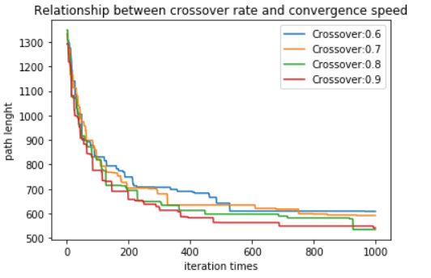
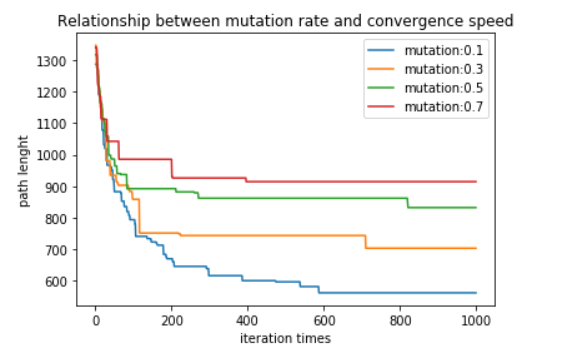
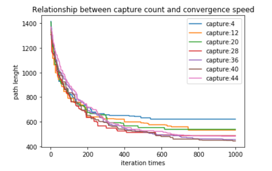
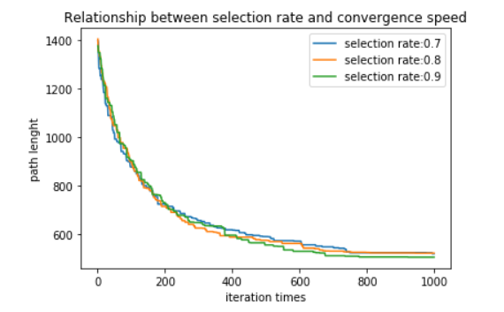
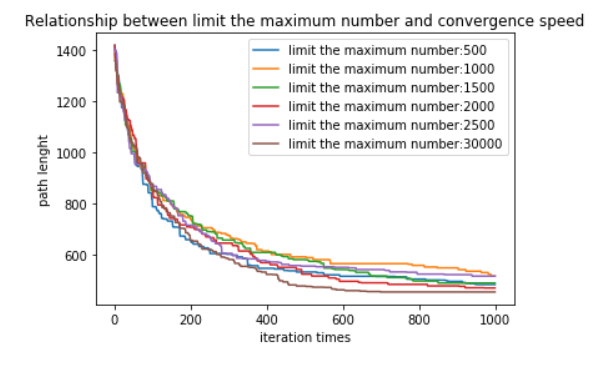
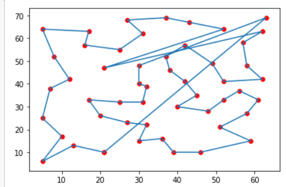
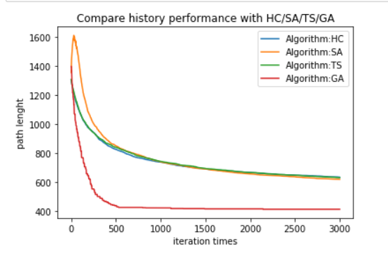

# 基因演算法解旅行銷售員的問題
## GA solves TSP problems

> 由於程式內容包含 "matplotlib animation" ，故檔案有點大，使用github無法直接查看 .ipynb  
> 請程式碼請直接clone .ipynb 到本地端查看! ^^  

>以下是各個參數選擇的收斂圖，用來挑選最佳的參數組合。  

>  
>探討交配率與收斂速度關係  

>  
>探討突變率與收斂速度關係  

>  
>探討擷取線段長與收斂速度關係  

>  
>探討篩選率與收斂速度關係  

>  
>探討限制族群數量範圍與收斂速度關係  

* 基於以上結果之最佳參數配置如下
  >crossover rate = 0.9
  >mutation rate = 0.1
  >capture = 40
  >selection rate = 0.9
  >limit the maximum number = 30000
* 結果
>  
>Best Path : [41, 18, 39, 40, 12, 24, 13, 23, 42, 6, 22, 47, 7, 25, 30, 27, 2, 5, 34, 19, 28, 20, 15, 1, 21, 0, 31, 10, 37, 4, 48, 8, 49, 33, 29, 9, 38, 32, 44, 14, 43, 36, 16, 3, 17, 46, 11, 45, 50, 26, 35] 
>Shortest Path Length :  428.503903255384  (**沒有加end-head的距離**) 

>
>比較之前的啟發式演算法的結果  
